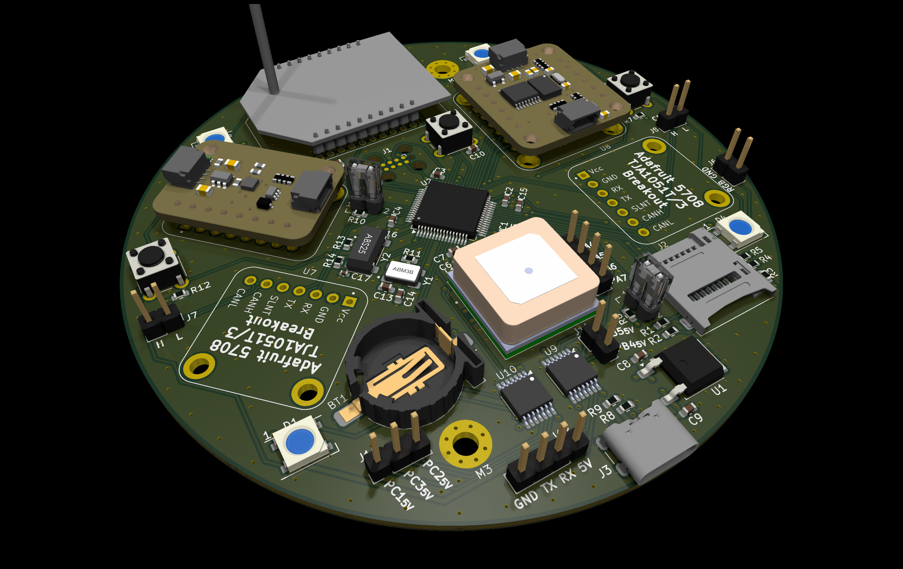

# nerve_ada_board

Nerve dev board using off-the-shelf modules.

- _Picture: Missing 3D models for 5708 TJA1051T/3 modules._

---

  
Table of Contents

- [1 Overview](#1-overview)
- [2 Development](#2-development)
- [3 Production History](#3-production-history)
    - [3.1 v0.1.0-alpha-7b18788](#31-v010-alpha-7b18788)

---

## 1 Overview

Development board for the STM32
based [nerve](https://github.com/danielljeon/nerve) controller firmware.

Specifically designed to use off-the-shelf plug-in boards, primarily from
Adafruit. See the table below:

| Manufacturer Part Number | Manufacturer            | Description                      | Quantity |
|--------------------------|-------------------------|----------------------------------|---------:|
| 4754                     | Adafruit Industries LLC | BNO085 Module                    |        1 |
| 4816                     | Adafruit Industries LLC | BMP390 Module                    |        1 |
| 5708                     | Adafruit Industries LLC | TJA1051T/3 Module                |        2 |
| Digi XBee-PRO 900HP      | Digi                    | Long Range 900 MHz OEM RF Module |        1 |

---

## 2 Development

Developed using KiCad with KiBot GitHub Actions
workflow, [kibot.yaml](.github/workflows/kibot.yaml).

- KiBot configurations found in [config.kibot.yaml](config.kibot.yaml).

CI/CD objectives:

1. ERC (Electrical Rule Check).
2. DRC (Design Rule Check).
3. PCB docs.
    - PCB layer docs (`.pdf` and `.svg`).
4. PCB manufacturing.
    - Gerber files (`.grb`).
    - Drill file (`.drl` and `.pdf` reference docs).
5. Assembly (fabrication service & hand assembly).
    - Pick-and-place assembly position file (`.pos`).
    - Component distributor ordering BoM (`.csv`).
    - General BoMs (`.xlsx` and `.html`).
    - Component placement guide (`.html`).
6. CAD.
    - (`.step`).

---

## 3 Production History

### 3.1 v0.1.0-alpha-7b18788

Commit: [7b18788](https://github.com/danielljeon/nerve_ada_board/commit/7b187884c03f280627d8443d2d9cc163f4b6956e).

Manufacturing Information:

1. Production date: 2024-10-22.
    - Manufacturer: JLCPCB.
    - Order: PCB, stencil.
    - PCB specs (non-default):
        - PCB quantity: 5.
        - Surface Finish: LeadFree HASL.
        - Impedance control stackup: `JLC041611-7628`.
            - Outer Copper Weight: 1 oz.
            - Inner Copper Weight: 1 oz.
    - Stencil specs (non-default):
        - Stencil quantity: 1.
        - Custom size: 100 mm x 100 mm (matching PCB dimensions).
2. Assembly date: TBD.
