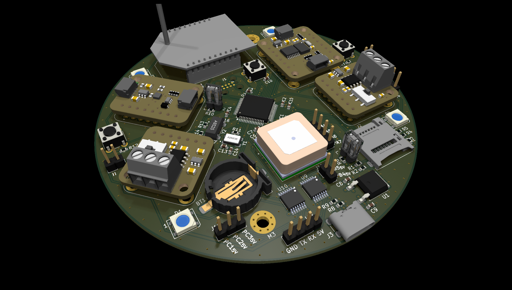

# nerve_ada_board


Nerve dev board using off-the-shelf modules.

> **Note: This design is now no longer under active development. The final
changes to the main branch are published as release tagged `v0.1.0-beta`,
see the release notes: [1.1 v0.1.0-beta](#11-v010-beta).**

> 💡**Hint:** To clone this repository use:
> ```shell
> git clone --recursive
> ```



---

<details markdown="1">
  <summary>Table of Contents</summary>

<!-- TOC -->
* [nerve_ada_board](#nerve_ada_board)
  * [1 Release Notes](#1-release-notes)
    * [1.1 v0.1.0-beta](#11-v010-beta)
      * [1.1.1 LSE Crystal](#111-lse-crystal)
      * [1.1.2 External Clock Crystal Tuning](#112-external-clock-crystal-tuning)
      * [1.1.3 GPS](#113-gps)
  * [2 Overview](#2-overview)
    * [2.1 Function Connectors](#21-function-connectors)
    * [2.2 Switches & Jumpers](#22-switches--jumpers)
    * [2.3 Plug-in Modules](#23-plug-in-modules)
    * [2.4 Breakout Connectors](#24-breakout-connectors)
  * [3 Development](#3-development)
    * [3.1 Worflow](#31-worflow)
    * [3.2 Submodules](#32-submodules)
  * [4 Production History](#4-production-history)
    * [4.1 v0.1.0-alpha-7b18788](#41-v010-alpha-7b18788)
<!-- TOC -->

</details>

---

## 1 Release Notes

### 1.1 v0.1.0-beta

Following the initial validation of components and software on this PCB design,
development has shifted to a more production-oriented
board: [nerve_pcb](https://github.com/danielljeon/nerve_pcb). While the base
components remain similar, many have been modified, with further
changes expected.

During the development of the new design, several hardware and PCB issues were
identified. Although this `README.md` will no longer be updated, the following
sections document the known issues as of the final release.

#### 1.1.1 LSE Crystal

The current LSE crystal on the STM32F446RE is the ABS25-32.768KHZ-6-T.

This is not the intended component; the correct crystal should have been the
`ABS25-32.768KHZ-T`, which has a more appropriate load capacitance specification
of 12.5 pF. The `ABS25-32.768KHZ-6-T` variant, with a 6 pF load capacitance, was
used inadvertently.

#### 1.1.2 External Clock Crystal Tuning

The crystal circuits use calculated capacitors that have not yet been fully
verified or fine-tuned. Specifically, the 32.768 kHz LSE crystal is likely using
incorrect capacitors with a value of 1.5 pF.

#### 1.1.3 GPS

The GPS module (`SAM-M10Q`) had not been verified to be functional as of the
release. However, this is likely due to software limitations rather than issues
with the hardware or PCB design.

---

## 2 Overview

Development board for the STM32
based [nerve](https://github.com/danielljeon/nerve) controller firmware.

### 2.1 Function Connectors

These connectors are fixed by hardware (PCB traces or the connector itself).

| Connector             | Ref | Description                                                                    |
|-----------------------|:---:|--------------------------------------------------------------------------------|
| Tag-Connect TC2050    | J1  | Programming/debug connector                                                    |
| Hinge microSD Card    | J2  | Portable storage, see [Molex product video](https://youtu.be/YY2V8z6UK7M?t=95) |
| USB-C 5 V Power       | J3  | Power only USB-C, primary 5 V source                                           |
| CR1220 Battery        | BT1 | MCU and GPS battery source 3.3 V supply                                        |
| CAN1 (Transceiver U7) | J7  | Pin 1: CAN1 High, Pin 2: CAN1 Low                                              |
| CAN2 (Transceiver U8) | J8  | Pin 1: CAN2 High, Pin 2: CAN2 Low                                              |

### 2.2 Switches & Jumpers

User controllable hardware and/or firmware driven inputs.

| Switch/Jumper           | Ref | Description                                    |
|-------------------------|:---:|------------------------------------------------|
| MCU NRESET Switch       | SW1 | Generic 6 mm TH button, push to reset          |
| MCU PA0 Switch          | SW2 | Generic 6 mm TH button, designed for SYS_WKUP0 |
| MCU PC13 Switch         | SW3 | Generic 6 mm TH button, designed for SYS_WKUP1 |
| SDIO Card Detect Jumper | J4  | Close for card inserted (pull-down on close)   |
| BOOT0 Jumper            | J5  | Open for run flash memory (pull-down on open)  |

### 2.3 Plug-in Modules

Off-the-shelf plug-in boards, primarily from Adafruit.

| Manufacturer Part Number |  Ref   | Manufacturer            | Hardware Interface | Quantity | Description                      |
|--------------------------|:------:|-------------------------|--------------------|---------:|----------------------------------|
| 4816                     |   U3   | Adafruit Industries LLC | 2.54 mm pitch TH   |        1 | BMP390 Module                    |
| Digi XBee-PRO 900HP      |   U5   | Digi                    | 2 mm pitch TH      |        1 | Long Range 900 MHz OEM RF Module |
| 4754                     |   U6   | Adafruit Industries LLC | 2.54 mm pitch TH   |        1 | BNO085 Module                    |
| 5708                     | U7, U8 | Adafruit Industries LLC | 2.54 mm pitch TH   |        2 | TJA1051T/3 Module                |

### 2.4 Breakout Connectors

Simple breakout connectors, driven fully or partially by firmware. See schematic
and firmware docs for details.

| Connector        | Ref | Logic | Description                                                                                     |
|------------------|:---:|:-----:|-------------------------------------------------------------------------------------------------|
| WS2812B Extender | J6  |  5 V  | Pin 1: PWM, Pin 2: Ground, use separate supply (preventing over current draw) and common ground |
| SPI Breakout     | J9  | 3.3 V | Pin 1: CS, Pin 2: SCK, Pin 3: MISO, Pin 4: MOSI                                                 |
| GPIO Breakout    | J10 |  5 V  | Pin 1, 2, 3: GPIO 1, 2, 3                                                                       |
| PWM Breakout     | J11 |  5 V  | Pin 1, 2: PWM 1, 2                                                                              |
| UART Camera      | J12 |  5 V  | Pin 1: 5 V, Pin 2: UART RX, Pin 3: UART TX, Pin 4: Ground, design for low current camera        |

---

## 3 Development

### 3.1 Worflow

Developed using KiCad with KiBot GitHub Actions
workflow, [kibot.yaml](.github/workflows/kibot.yaml).

- KiBot configurations found in [config.kibot.yaml](config.kibot.yaml).

CI/CD objectives:

1. ERC (Electrical Rule Check).
2. DRC (Design Rule Check).
3. PCB docs.
    - PCB layer docs (`.pdf` and `.svg`).
4. PCB manufacturing.
    - Gerber files (`.grb`).
    - Drill file (`.drl` and `.pdf` reference docs).
5. Assembly (fabrication service & hand assembly).
    - Pick-and-place assembly position file (`.pos`).
    - Component distributor ordering BoM (`.csv`).
    - General BoMs (`.xlsx` and `.html`).
    - Component placement guide (`.html`).
6. CAD.
    - (`.step`).

### 3.2 Submodules

This repository includes the submodule `component_library`, located
at: [component_library](https://github.com/danielljeon/component_library).

When cloning the repository, make sure to use the recursive option:

```shell
git clone --recursive
```

To update the submodule to its latest version in a cloned repository, use the
following command:

> Note: This is not recommended for this deprecated repository, as pulling
> updates from the submodule's latest commit may result in incompatibilities.

```shell
git submodule update --remote --merge
```

---

## 4 Production History

### 4.1 v0.1.0-alpha-7b18788

Commit: [7b18788](https://github.com/danielljeon/nerve_ada_board/commit/7b187884c03f280627d8443d2d9cc163f4b6956e).

<details markdown="1">
  <summary>Manufacturing & Assembly Details</summary>

**Manufacturing Information:**

Production date: 2024-10-22.

- Manufacturer: JLCPCB.
- Order: PCB, stencil.
- PCB specs (non-default):
    - PCB quantity: 5.
    - Surface Finish: LeadFree HASL.
    - Impedance control stackup: `JLC041611-7628`.
        - Outer Copper Weight: 1 oz.
        - Inner Copper Weight: 1 oz.
- Stencil specs (non-default):
    - Stencil quantity: 1.
    - Custom size: 100 mm x 100 mm (matching PCB dimensions).

**Assembly Information:**

Assembly date: 2024-11-09 to 2024-11-13.

- Assembled PCB quantity: 2.
- Process:
    - Stencil solder paste print by hand & soldering iron.
        - Solder paste: Chip Quik TS391LT `Bi57.6Sn42Ag0.4`.
    - SMD pick-and-place by hand.
    - Reflow with oven.
        - Roughly correct temperatures to solder paste docs.
        - Approximately doubled soak time due to oven limitations.

1. PCB 1 Notes:
    - Components: All placed except for GPS.
    - Damage to though holes for connector J4 mostly on bottom side.
        - First assembly was unsatisfactory.
        - Attempt to remove solder to reassemble header pins resulted in damage
          from aggressive force with the soldering iron.
        - Final result was functional, but the board damage remains on bottom
          side.
            - Suggested correction: heat soak the board, note also left in board
              evaluation section of this writeup.
        - Continuity tests showed no issues after completion.
    - Bridged pins on the U2 (STM32F446RE).
        - Likely too much solder paste and less than ideal definition of the
          printed solder paste.
        - Resolved with flux and reheat with soldering iron as well as use of
          solder wick.
            - Suggested correction: Cleaner swipe of the stencil with less
              solder paste.
2. PCB 2 Notes:
    - Components: All placed.
    - Misplacement of U2 (STM32F446RE).
        - Component shifted seemingly during reflow, some sides of the MCU had
          short or unconnected pins.
        - There was likely too much solder as well as potential misalignment
          during the pick-and-place by hand.
        - Attempts were made to reposition the component.
        - Some solder mask was removed near the pads, however no significant
          functional concerns were visible.
        - In order to limit potential damage to the board or components (
          particularly the expensive GPS module), the component was removed.
        - No pad damage was visible.
        - A replacement component was hand soldered with a soldering iron.
            - Suggested correction: Improve solder paste printing (again) and
              better hand placement. If too much paste was visible retry before
              any reflow. Perhaps, even holding the component in position with
              thin strips of kapton tape.
    - Bridged pins on the U9, U10 (TXB0104QPWRQ1).
        - Same details as U2 on PCB 1 (see above).
    - U4 GPS module solder joints are not visible (pads under component), but a
      continuity test of nets in every combination pair showed no shorts.

</details>


**Board Evaluation:**

- Large planes, especially ground. It is difficult to adjust through hole
  components that have ground pin(s).
    - Requires heat soaked board or potentially risky soldering iron
      temperatures.
- Some components such as resistors or capacitors are very close to through hole
  header pin connectors/jumpers.
    - Not super difficult to deal with, but something to keep in mind.
- The XBee Pro 900HP can cause clearance issues when trying to press-release the
  nearby TC2050-IDC's plastic clips.
- The Molex 472192001 hinge microSD card slot is functional, but slightly
  blocked by the Adafruit TJA1051T/3 breakout board.
    - This Would be easily resolved by implementing CAN circuit/components
      directly onto the PCB.
